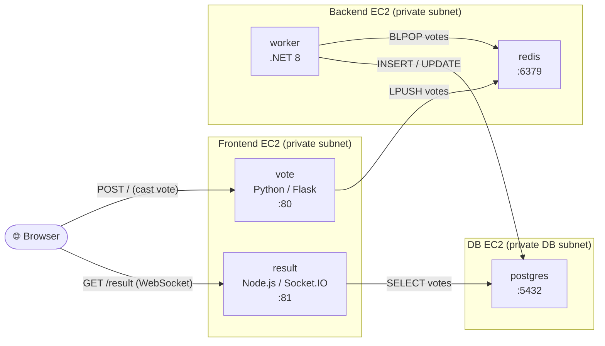
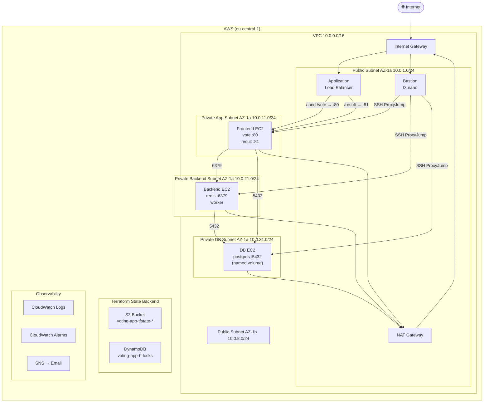
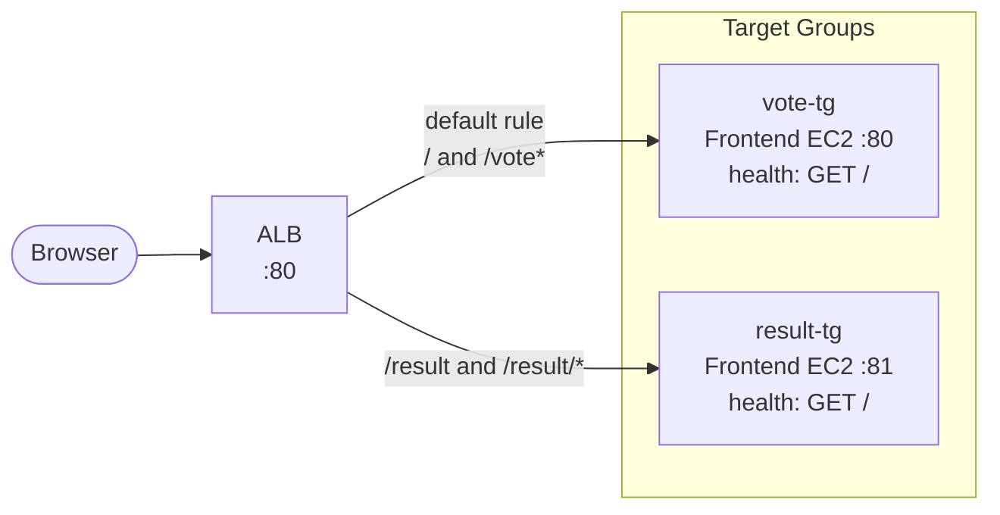
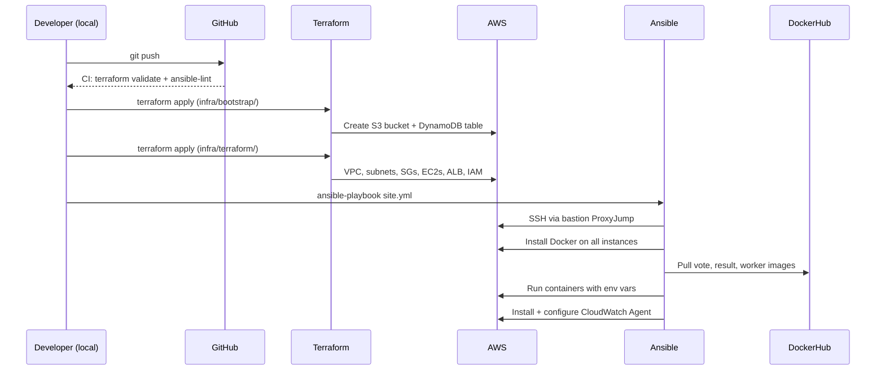

# Solution Architecture — Multi-Stack Voting App

## Overview

A polyglot microservices application deployed on AWS, demonstrating end-to-end DevOps practices:
containerization, infrastructure-as-code, configuration management, and observability.

| Concern | Tool |
|---|---|
| Containerization | Docker, DockerHub |
| Infrastructure | Terraform (IaC), AWS |
| Configuration & Deploy | Ansible |
| Monitoring | CloudWatch Logs, Metrics, Alarms |
| Source Control | Git / GitHub |
| State Backend | S3 + DynamoDB |

---

## 1. Application Architecture

Five services form the voting pipeline. A vote cast in the browser travels through four hops before the result is visible.



### Service Responsibility

| Service | Technology | Host | Role |
|---|---|---|---|
| **vote** | Python 3.11 / Flask / gunicorn | Frontend EC2 | Accepts votes from browser, pushes to Redis queue |
| **redis** | Redis Alpine | Backend EC2 | In-memory queue — buffers votes between vote and worker |
| **worker** | .NET 8 | Backend EC2 | Drains Redis queue, upserts votes into PostgreSQL |
| **result** | Node.js 18 / Socket.IO | Frontend EC2 | Reads from PostgreSQL, streams live counts to browser via WebSocket |
| **postgres** | PostgreSQL 15 | DB EC2 | Persistent vote store |

### Environment Variables (Connection Wiring)

| Container | Variable | Value |
|---|---|---|
| `vote` | `REDIS_HOST` | Backend EC2 private IP |
| `worker` | `REDIS_HOST` | Backend EC2 private IP |
| `worker` | `DB_HOST` | DB EC2 private IP |
| `worker` | `DB_USERNAME` | `postgres` |
| `worker` | `DB_PASSWORD` | (from Ansible vault or env) |
| `result` | `PG_HOST` | DB EC2 private IP |
| `result` | `PG_USER` | `postgres` |
| `result` | `PG_PASSWORD` | (from Ansible vault or env) |

---

## 2. Network Architecture



> **Single NAT Gateway** — all private subnets share one NAT in AZ-1a. This is a deliberate cost trade-off (~€1.20/day vs. ~€2.40/day for HA NAT). See `docs/decisions/004-single-nat-gateway.md`.

---

## 3. ALB Path Routing

The Application Load Balancer is the single public entry point. It routes by URL path:

```
lb-xxx.eu-central-1.elb.amazonaws.com/           →  vote  (Frontend EC2 :80)
lb-xxx.eu-central-1.elb.amazonaws.com/result      →  result (Frontend EC2 :81)
lb-xxx.eu-central-1.elb.amazonaws.com/result/*    →  result (Frontend EC2 :81)  ← WebSocket upgrade path
```



> **WebSocket risk:** Socket.IO (result app) requires the ALB to support WebSocket upgrades. The listener must have idle timeout ≥ 60s. If path-stripping causes issues with the `/socket.io/` path, fall back to port-based routing and document in ADR-005. See Epic 10 in the plan.

---

## 4. Security Group Matrix

All private instance SGs use **SG-to-SG references**, never open CIDRs. This is Add-on #1 (Proper Security Group Configs).

| Security Group | Inbound Rule | Source | Port |
|---|---|---|---|
| **alb-sg** | HTTP from internet | `0.0.0.0/0` | 80 |
| **bastion-sg** | SSH from operator | `<your-public-ip>/32` | 22 |
| **frontend-sg** | HTTP from ALB | `alb-sg` | 80, 81 |
| **frontend-sg** | SSH from bastion | `bastion-sg` | 22 |
| **backend-sg** | Redis from frontend | `frontend-sg` | 6379 |
| **backend-sg** | SSH from bastion | `bastion-sg` | 22 |
| **db-sg** | Postgres from backend | `backend-sg` | 5432 |
| **db-sg** | Postgres from frontend | `frontend-sg` | 5432 |
| **db-sg** | SSH from bastion | `bastion-sg` | 22 |

All outbound: unrestricted (instances need outbound to pull Docker images via NAT).

---

## 5. Infrastructure Components

| Component | Type | Size | Subnet | Purpose |
|---|---|---|---|---|
| Bastion | EC2 | t3.nano | Public | SSH entry point; Ansible runs from here |
| Frontend | EC2 | t3.micro | Private App | Hosts `vote` + `result` containers |
| Backend | EC2 | t3.micro | Private App | Hosts `redis` + `worker` containers |
| DB | EC2 | t3.micro | Private DB | Hosts `postgres` with named volume |
| ALB | Load Balancer | — | 2× Public | Path-based routing to frontend |
| NAT Gateway | Managed | — | Public AZ-1a | Outbound internet for private subnets |
| S3 Bucket | Object Storage | — | — | Terraform remote state |
| DynamoDB | NoSQL Table | On-demand | — | Terraform state locking |
| CloudWatch | Managed | — | — | Logs, metrics, alarms |

---

## 6. Deployment Flow



---

## 7. Observability

| Signal | Source | Destination | Alert Condition |
|---|---|---|---|
| Container logs | Docker via CW Agent | CloudWatch Logs | — |
| System logs | `/var/log/syslog` | CloudWatch Logs | — |
| CPU metric | CW Agent | CloudWatch Metrics | > 80% for 5 min → SNS |
| Disk metric | CW Agent | CloudWatch Metrics | > 80% used → SNS |
| ALB unhealthy hosts | ALB | CloudWatch Metrics | > 0 unhealthy → SNS |
| SNS | CloudWatch Alarm | Email | Configured at deploy |

---

## 8. Key Design Decisions

| Decision | Choice | Alternative Considered | ADR |
|---|---|---|---|
| Single vs HA NAT Gateway | Single (cost) | HA NAT (~€2.40/day extra) | ADR-004 |
| Bastion vs SSM | Dedicated bastion | AWS SSM Session Manager (no bastion) | ADR-003 |
| ALB routing strategy | Path-based | Port-based (2 listeners) | ADR-005 |
| .NET version | .NET 8 (LTS) | .NET 7 (EOL May 2024) | ADR-002 |
| EC2 placement | All in AZ-1a | Multi-AZ (higher cost) | ADR-001 |
| Terraform state | S3 + DynamoDB | Terraform Cloud | ADR-003 |

> ADRs live in `docs/decisions/`. Each documents the context, options considered, decision, and consequences.
